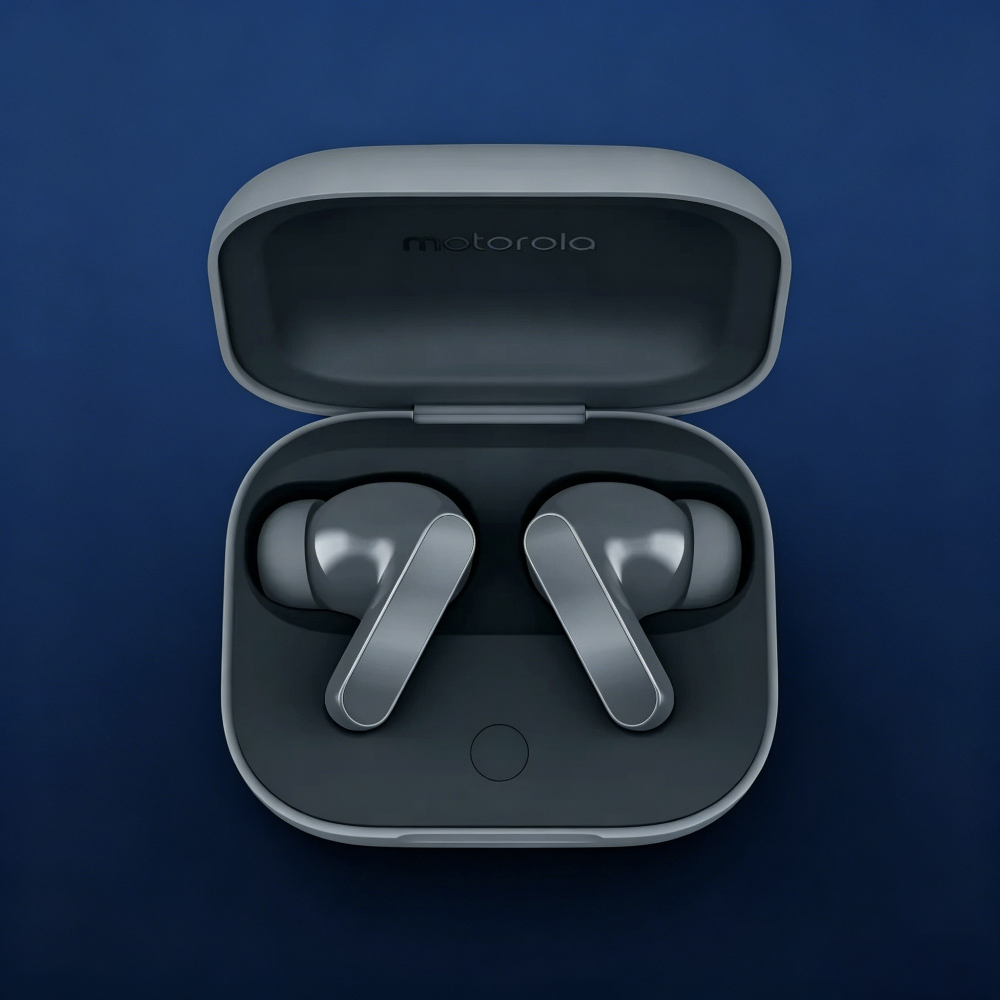
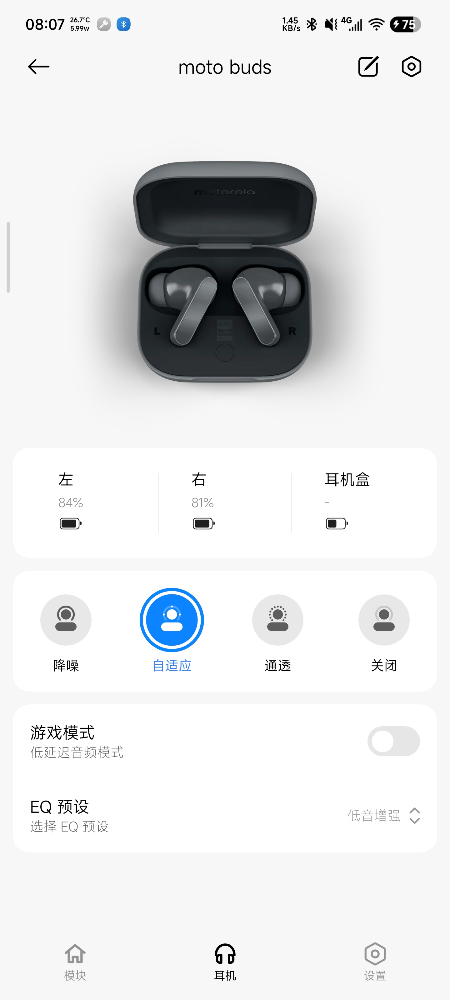
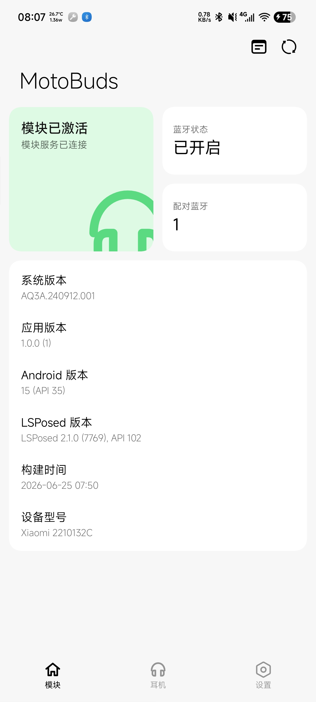
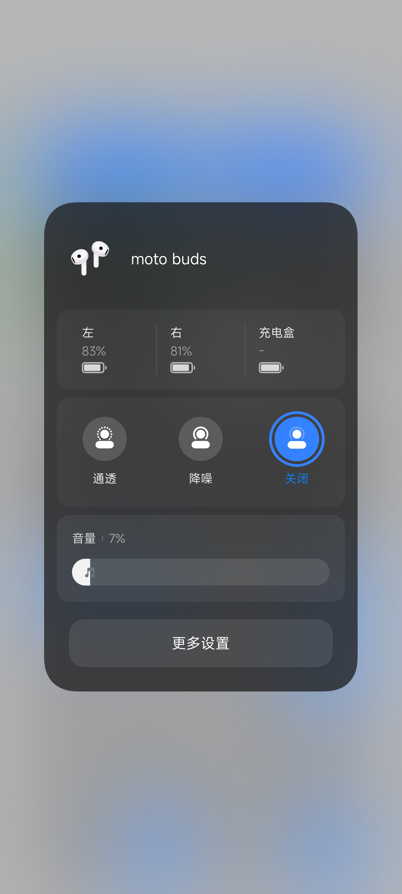
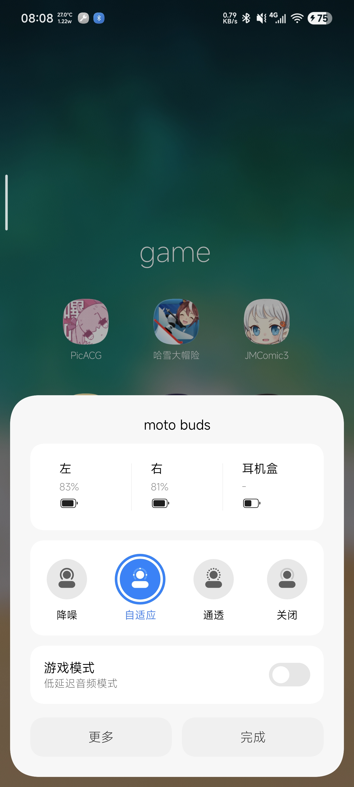

<div align="center">



# 🎧 MotoBuds for Hyper

### Motorola を HyperOS に導入

[](https://android.com)
[](https://github.com/LSPosed/LSPosed)
[](https://hyperos.mi.com)
[](LICENSE)
[](https://github.com/pubglite55/motobuds-for-hyper/releases)

<br/>

[English](README-EN.md) | [简体中文](README.md) | **日本語**

<br/>

*Moto Buds を Xiaomi エコシステムで快適に使うための Xposed モジュール 🐟*

</div>

---

## 🤔 なぜ MotoBuds for Hyper が必要？

Moto Buds に高いお金を出して買ったのに、HyperOS 上では「外国人」扱い——

- 😢 スーパーアイランドのバッテリー表示がない
- 😢 フュージョンデバイスセンターの制御がない
- 😢 通知バーが空っぽ
- 😢 システム設定で NC を制御できない

**MotoBuds for Hyper** はこのギャップを埋め、Moto Buds に Xiaomi エコシステムの全機能を提供します！🎉

---

## 🎯 主な機能一覧

<table>
<tr>
<td width="50%">

### 🔇 ノイズキャンセリング制御
**オフ** / **ノイズキャンセリング** / **アダプティブ** / **トランスペアレンシー** モードをワンタップで切り替え。ネイティブ Xiaomi ヘッドセットのようにスムーズ

### 🎮 ゲームモード
低レイテンシーオーディオモード、**接続時に自動有効化**対応。ゲーム中の遅延を解消

### 🔋 バッテリー表示
左耳、右耳、充電ケースのバッテリーをリアルタイム表示。スーパーアイランドにも同期

</td>
<td width="50%">

### 🎛️ EQプリセット
5つのプリセットを選択可能：
- オーソン
- ブライトトレブル
- ベースブースト
- ボーカルブースト
- マニュアルチューニング

### 🏝️ スーパーアイランド
HyperOS 3 公式スーパーアイランドまたはモジュール内蔵アイランド対応

### 📱 フュージョンデバイスセンター
システム設定で直接ヘッドセットを制御、**マルチデバイスワンタップハンドオフ**対応

</td>
</tr>
</table>

---

## 🚀 クイックスタート（4ステップ）

```
1️⃣  APK をインストール
2️⃣  LSPosed でモジュールを有効化 → 推奨スコープを選択
3️⃣  スコープを再起動（またはスマホを再起動）
4️⃣  Bluetooth で Moto Buds を接続 — 準備完了！
```

<details>
<summary>📱 推奨スコープ（クリックで表示）</summary>

| スコープ | 説明 |
|----------|------|
| `com.android.bluetooth` | Bluetooth サービス（コア） |
| `com.milink.service` | MiLink サービス（フュージョンデバイスセンター） |
| `com.xiaomi.bluetooth` | Xiaomi Bluetooth（通知/スーパーアイランド） |

</details>

<details>
<summary>⚠️ よくある質問</summary>

**Q: NC モードを切り替えたときにアダプティブモードに戻るのはなぜ？**

A: まず公式の `com.motorola.motobuds` アプリで個人アダプテーションを作成してください。

**Q: インストール後に「モジュールサービスタイムアウト」が表示される？**

A: LSPosed でモジュールが有効で、推奨スコープが選択されていることを確認してください。スコープを再起動またはスマホを再起動してください。

**Q: バッテリー表示が正確でない？**

A: Bluetooth 接続が安定していることを確認してください。モジュールは15秒ごとに自動同期します。

</details>

---

## 🛠️ 技術アーキテクチャ

```
┌─────────────────────────────────────────────────────┐
│                  MotoBuds for Hyper                  │
├─────────────┬─────────────────┬─────────────────────┤
│  RFCOMM SPP │   Xposed Hook   │    Compose UI       │
│ (Bluetooth) │   (システム)     │   (インターフェース)  │
├─────────────┼─────────────────┼─────────────────────┤
│  UUID:       │   HookEntry:    │   Miuix:            │
│  fc9d9fe0-   │   com.android   │   HyperOS 風        │
│  4899-11ee   │   .bluetooth    │   Compose UI        │
│  -be56-...   │   com.xiaomi    │                     │
│              │   .bluetooth    │                     │
├─────────────┼─────────────────┼─────────────────────┤
│  プロトコル:  │   スコープ:      │   言語:             │
│  MotoBuds    │   Bluetooth/    │   EN/ZH/JA          │
│  SPP カスタム │   MiLink/Xiaomi │                     │
└─────────────┴─────────────────┴─────────────────────┘
```

---

## 📋 対応デバイス

| デバイス | 型番 | コード名 | ステータス |
|----------|------|----------|:----------:|
| Moto Buds | XT2443-1 | guitar | ✅ |

---

## 📦 機能詳細

| 機能 | 説明 | ステータス |
|------|------|:----------:|
| 🔇 NC制御 | オフ/NC/アダプティブ/トランスペアレンシー | ✅ |
| 🎮 ゲームモード | 低レイテンシーオーディオ + 自動有効化 | ✅ |
| 🔋 バッテリー表示 | 左/右/ケース リアルタイム同期 | ✅ |
| 🎛️ EQプリセット | 5つのプリセット | ✅ |
| 🏝️ スーパーアイランド | システムレベルバッテリーアイランド | ✅ |
| 📱 フュージョンデバイスセンター | システム設定統合 | ✅ |
| 🔄 デバイスハンドオフ | マルチデバイスワンタップ切替 | ✅ |
| 📢 通知統合 | 通知バークイック制御 | ✅ |
| 🎯 クイックポップアップ | 通知/コントロールセンターポップアップ | ✅ |
| ⚙️ システム設定 | Bluetooth設定で制御 | ✅ |
| 🌐 多言語 | 中国語/英語/日本語 | ✅ |

> **💡 ヒント：** NC モードを切り替えたときにアダプティブモードに戻る場合は、まず公式の `com.motorola.motobuds` アプリで個人アダプテーションを作成してください。

---

## 📸 スクリーンショット

<table>
<tr>
<td align="center"></td>
<td align="center"></td>
</tr>
<tr>
<td align="center">🎧 ヘッドセットページ</td>
<td align="center">🏠 モジュールページ</td>
</tr>
<tr>
<td align="center"></td>
<td align="center"></td>
</tr>
<tr>
<td align="center">📱 milink エミュレートデバイス</td>
<td align="center">⚡ クイックポップアップ</td>
</tr>
</table>

---

## 📁 プロジェクト構成

```
MotoBuds/
├── app/
│   └── src/main/
│       ├── java/moe/chenxy/oppopods/
│       │   ├── config/          # 設定管理
│       │   ├── hook/            # Xposed Hook
│       │   │   ├── milink/      # MiLink サービス Hook
│       │   │   └── ...
│       │   ├── pods/            # ヘッドセットプロトコル
│       │   │   ├── Packets.kt   # プロトコルパケット
│       │   │   ├── RfcommController.kt  # RFCOMM コントローラー
│       │   │   └── ...
│       │   ├── ui/              # Compose UI
│       │   │   ├── components/  # UI コンポーネント
│       │   │   ├── dialogs/     # ダイアログ
│       │   │   └── pages/       # ページ
│       │   └── utils/           # ユーティリティ
│       ├── res/                 # リソースファイル
│       └── assets/
│           └── xposed_init      # Xposed エントリー
├── docs/                        # スクリーンショット
├── README.md                    # 中国語ドキュメント
├── README-EN.md                 # 英語ドキュメント
└── README-jp.md                 # 本文書
```

---

## 🤝 クレジット

このプロジェクトは巨人の肩の上に立っています：

| プロジェクト | 著者 | 貢献 |
|-------------|------|------|
| [OppoPods-Enhanced](https://github.com/1812z/OppoPods) | 1812z | オリジナルフレームワーク |
| [HyperPods](https://github.com/Art-Chen/HyperPods) | Art_Chen | オリジナルプロジェクト |
| [Miuix](https://github.com/YuKongA/miuix) | YuKongA | HyperOS UI コンポーネント |

---

## 📜 ライセンス

本プロジェクトは **GPL-3.0** オープンソースライセンスの下で提供されています。

```
Copyright (C) 2026 xiuxiu391

This program is free software: you can redistribute it and/or modify
it under the terms of the GNU General Public License as published by
the Free Software Foundation, either version 3 of the License, or
(at your option) any later version.
```

---

<div align="center">

**このプロジェクトが役に立った場合は、⭐ Star で応援してください！**

<br/>


<br/>

*Moto Buds コミュニティのために ❤️ を込めて*

*Star と Issue へのご支持を感謝します 🙏*

</div>
