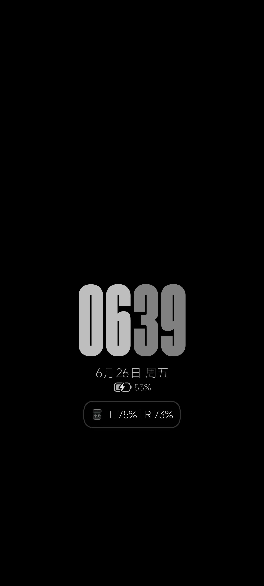
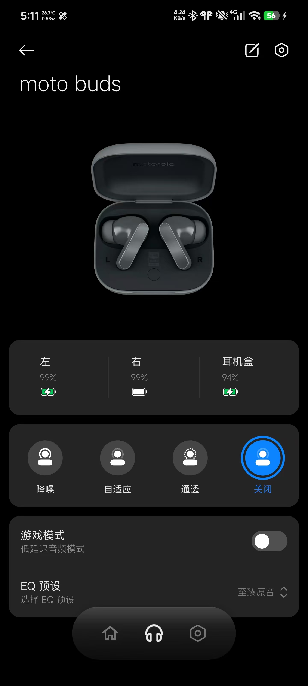

<div align="center">


# 🎧 MotoBuds for Hyper

### 把 Motorola 带进 HyperOS

[](https://android.com)
[](https://github.com/LSPosed/LSPosed)
[](https://hyperos.mi.com)
[](LICENSE)
[](https://github.com/pubglite55/motobuds-for-hyper/releases)

<br/>

[English](README-EN.md) | **简体中文** | [日本語](README-jp.md)

<br/>

*一个让你的 Moto Buds 在小米生态中如鱼得水的 Xposed 模块 🐟*

</div>

---

## 🤔 为什么需要 MotoBuds for Hyper？

你花了大价钱买了 Moto Buds，却发现它在 HyperOS 上像个「外来户」——

- 😢 没有超级岛电量显示
- 😢 没有融合设备中心控制  
- 😢 通知栏一片空白
- 😢 无法在系统设置中控制降噪

**MotoBuds for Hyper** 填补了这个鸿沟，让你的 Moto Buds 享受小米生态的全部礼遇！🎉

---

## 🎯 核心功能一览

<table>
<tr>
<td width="50%">

### 🔇 降噪控制
在 **关闭** / **降噪** / **自适应** / **通透** 模式间一键切换，像原生小米耳机一样丝滑

### 🎮 游戏模式
低延迟音频模式，支持**连接时自动开启**，打游戏再也不怕延迟

### 🔋 电量显示
实时显示左耳、右耳、充电盒电量，**支持充电状态显示**，超级岛同步显示

</td>
<td width="50%">

### 🎛️ EQ 预设
5 种预设模式可选：
- 至臻原音
- 明亮高音
- 低音增强
- 人声增强
- MotoBuds 手动调音

### 🏝️ 超级岛集成
支持 HyperOS 3 官方超级岛或模块内建超级岛

### 📱 融合设备中心
在系统设置中直接控制耳机，支持**多设备一键流转**

</td>
</tr>
</table>

---

## 🚀 快速上手（4 步搞定）

```
1️⃣  安装 APK
2️⃣  在 LSPosed 中启用模块 → 勾选推荐作用域
3️⃣  重启作用域（或重启手机）
4️⃣  蓝牙连接你的 Moto Buds — 一切就绪！
```

<details>
<summary>📱 推荐作用域（点击查看）</summary>

| 作用域 | 说明 |
|--------|------|
| `com.android.bluetooth` | 蓝牙服务（核心） |
| `com.milink.service` | MiLink 服务（融合设备中心） |
| `com.xiaomi.bluetooth` | 小米蓝牙（通知/超级岛） |

</details>

<details>
<summary>⚠️ 常见问题</summary>

**Q: 切换降噪模式时，为什么会回弹为自适应模式？**

A: 请先在官方 `com.motorola.motobuds` APP 中创建个人适配，然后再使用模块即可。

**Q: 安装后 LSPosed 显示「模块服务超时」？**

A: 请确认已在 LSPosed 中启用模块并勾选推荐作用域，然后重启作用域或手机。

**Q: 电量显示不准确？**

A: 请确保蓝牙连接稳定，模块会自动每 15 秒同步状态。

</details>

---

## 🛠️ 技术架构

```
┌─────────────────────────────────────────────────────┐
│                  MotoBuds for Hyper                  │
├─────────────┬─────────────────┬─────────────────────┤
│  RFCOMM SPP │   Xposed Hook   │    Compose UI       │
│  (蓝牙通信)  │   (系统注入)     │    (界面渲染)        │
├─────────────┼─────────────────┼─────────────────────┤
│  UUID:       │   HookEntry:    │   Miuix:            │
│  fc9d9fe0-   │   com.android   │   HyperOS 风格       │
│  4899-11ee   │   .bluetooth    │   Compose 组件       │
│  -be56-...   │   com.xiaomi    │                     │
│              │   .bluetooth    │                     │
├─────────────┼─────────────────┼─────────────────────┤
│  协议:       │   作用域:        │   语言:              │
│  MotoBuds    │   蓝牙/MiLink   │   中/英/日           │
│  SPP 专有    │   /小米蓝牙      │                     │
└─────────────┴─────────────────┴─────────────────────┘
```

---

## 📋 支持的设备

| 设备 | 型号 | 内部代号 | 状态 |
|------|------|----------|:----:|
| Moto Buds | XT2443-1 | guitar | ✅ |

---

## 📦 功能详情

| 功能 | 描述 | 状态 |
|------|------|:----:|
| 🔇 降噪控制 | 关闭/降噪/自适应/通透 | ✅ |
| 🎮 游戏模式 | 低延迟音频 + 自动开启 | ✅ |
| 🔋 电量显示 | 左耳/右耳/充电盒实时同步 | ✅ |
| 🎛️ EQ预设 | 5种预设模式可选 | ✅ |
| 🏝️ 超级岛 | 系统级电量岛显示 | ✅ |
| 📱 融合设备中心 | 系统设置集成 | ✅ |
| 🔄 设备流转 | 多设备一键切换 | ✅ |
| 📢 通知集成 | 通知栏快捷控制 | ✅ |
| 🎯 快捷弹窗 | 通知/控制中心弹出控制 | ✅ |
| ⚙️ 系统设置 | 蓝牙设置中控制耳机 | ✅ |
| 🌐 多语言 | 中文/英文/日文 | ✅ |
| 🔋 低电量提醒 | 电量低于20%时通知 | ✅ |
| 🔄 自动重连 | 耳机断开后自动重新连接 | ✅ |
| 📖 首次引导 | 首次启动时显示功能介绍 | ✅ |

> **💡 温馨提示：** 切换降噪模式时，若回弹为自适应模式，请先在官方 `com.motorola.motobuds` APP 中创建个人适配后即可正常使用。

---

## 📸 截图

<table>
<tr>
<td align="center"></td>
<td align="center"></td>
</tr>
<tr>
<td align="center">🎧 耳机主界面</td>
<td align="center">🏠 模块主页</td>
</tr>
</table>

---

## 📁 项目结构

```
MotoBuds/
├── app/
│   └── src/main/
│       ├── java/moe/chenxy/oppopods/
│       │   ├── config/          # 配置管理
│       │   ├── hook/            # Xposed Hook 实现
│       │   │   ├── milink/      # MiLink 服务 Hook
│       │   │   └── ...
│       │   ├── pods/            # 耳机协议通信
│       │   │   ├── Packets.kt   # 协议包定义
│       │   │   ├── RfcommController.kt  # RFCOMM 控制器
│       │   │   └── ...
│       │   ├── ui/              # Compose UI
│       │   │   ├── components/  # UI 组件
│       │   │   ├── dialogs/     # 对话框
│       │   │   └── pages/       # 页面
│       │   └── utils/           # 工具类
│       ├── res/                 # 资源文件
│       └── assets/
│           └── xposed_init      # Xposed 入口
├── docs/                        # 截图文档
├── README.md                    # 本文档
├── README-EN.md                 # 英文文档
└── README-jp.md                 # 日文文档
```

---

## 🤝 致谢

本项目站在巨人的肩膀上：

| 项目 | 作者 | 贡献 |
|------|------|------|
| [OppoPods-Enhanced](https://github.com/1812z/OppoPods) | 1812z | 原始框架 |
| [HyperPods](https://github.com/Art-Chen/HyperPods) | Art_Chen | 原始项目 |
| [Miuix](https://github.com/YuKongA/miuix) | YuKongA | HyperOS UI 组件 |

---

## 📜 许可证

本项目采用 **GPL-3.0** 开源许可证。

```
Copyright (C) 2026 xiuxiu391

This program is free software: you can redistribute it and/or modify
it under the terms of the GNU General Public License as published by
the Free Software Foundation, either version 3 of the License, or
(at your option) any later version.
```

---

<div align="center">

**如果这个项目对你有帮助，请给个 ⭐ Star 支持一下！**

<br/>


<br/>

*Made with ❤️ for the Moto Buds community*

*感谢每一位 Star 和 Issue 的支持 🙏*

</div>
