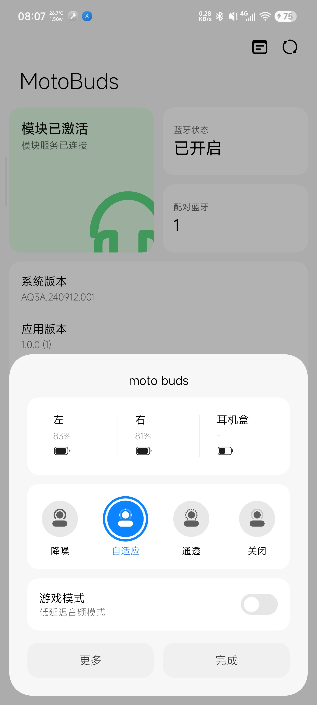

<div align="center">


# 🎧 MotoBuds for Hyper

### 把 Motorola 带进 HyperOS

[](https://android.com)
[](https://github.com/LSPosed/LSPosed)
[](https://hyperos.mi.com)
[](LICENSE)

<br/>

[English](README-EN.md) | **简体中文** | [日本語](README-jp.md)

*一个让你的 Moto Buds 在小米生态中如鱼得水的 Xposed 模块*

</div>

---

## ✨ 为什么需要 MotoBuds for Hyper？

你花了大价钱买了 Moto Buds，却发现它在 HyperOS 上像个「外来户」——没有超级岛电量显示，没有融合设备中心控制，通知栏也是一片空白。

**MotoBuds for Hyper** 填补了这个鸿沟，让你的 Moto Buds 享受小米生态的全部礼遇。

---

## 🎯 核心功能

<table>
<tr>
<td width="50%">

### 🔇 降噪控制
在 **关闭** / **降噪** / **自适应** / **通透** 模式间一键切换

### 🎮 游戏模式
低延迟音频模式，支持**连接时自动开启**

### 🔋 电量显示
实时显示左耳、右耳、充电盒电量

</td>
<td width="50%">

### 🎛️ EQ 预设
5 种预设模式可选：至臻原音、明亮高音、低音增强、人声增强、手动调音

### 🏝️ 超级岛集成
支持 HyperOS 3 官方超级岛或模块内建超级岛

### 📱 融合设备中心
在系统设置中直接控制耳机，支持**多设备一键流转**

</td>
</tr>
</table>

---

## 🚀 快速上手

```
1️⃣  安装 APK
2️⃣  在 LSPosed 中启用模块 → 勾选推荐作用域
3️⃣  重启作用域（或重启手机）
4️⃣  蓝牙连接你的 Moto Buds — 一切就绪！
```

<details>
<summary>📱 推荐作用域</summary>

- `com.android.bluetooth`
- `com.milink.service`
- `com.xiaomi.bluetooth`

</details>

---

## 🛠️ 技术架构

```
┌─────────────────────────────────────────────┐
│              MotoBuds for Hyper              │
├─────────────┬───────────────┬───────────────┤
│  RFCOMM SPP │  Xposed Hook  │  Compose UI   │
│  (蓝牙通信)  │  (系统注入)    │  (界面渲染)    │
├─────────────┼───────────────┼───────────────┤
│  UUID:       │  HookEntry:   │  Miuix:       │
│  fc9d9fe0-   │  com.android  │  HyperOS 风格  │
│  4899-11ee   │  .bluetooth   │  Compose 组件  │
│  -be56-...   │  com.xiaomi   │               │
│              │  .bluetooth   │               │
└─────────────┴───────────────┴───────────────┘
```

---

## 📋 支持的设备

| 设备 | 型号 | 状态 |
|------|------|:----:|
| Moto Buds | XT2443-1 (guitar) | ✅ |

---

## 📦 支持的功能

| 功能 | 描述 | 状态 |
|------|------|:----:|
| 🔇 降噪控制 | 关闭/降噪/自适应/通透 | ✅ |
| 🎮 游戏模式 | 低延迟音频 | ✅ |
| 🔋 电量显示 | 左耳/右耳/充电盒 | ✅ |
| 🎛️ EQ预设 | 5种预设模式 | ✅ |
| 🏝️ 超级岛 | 系统级电量岛显示 | ✅ |
| 📱 融合设备中心 | 系统设置集成 | ✅ |
| 🔄 设备流转 | 多设备一键切换 | ✅ |

> **💡 提示：** 切换降噪模式时，若回弹为自适应模式，请先在官方 `com.motorola.motobuds` APP 中创建个人适配后即可正常使用。

---

## 📸 截图

<table>
<tr>
<td align="center"></td>
<td align="center"></td>
</tr>
<tr>
<td align="center">耳机主界面</td>
<td align="center">模块主页</td>
</tr>
<tr>
<td align="center"></td>
<td align="center"></td>
</tr>
<tr>
<td align="center">milink 仿造设备</td>
<td align="center">快捷弹窗</td>
</tr>
</table>

---

## 🤝 致谢

本项目站在巨人的肩膀上：

| 项目 | 作者 | 贡献 |
|------|------|------|
| [OPPOPods](https://github.com/1812z/OppoPods) | 1812z | 原始框架 |
| [HyperPods](https://github.com/Art-Chen/HyperPods) | Art_Chen | 原始项目 |
| [Miuix](https://github.com/YuKongA/miuix) | YuKongA | HyperOS UI 组件 |

---

## 📜 许可证

```
GPL-3.0 License

This program is free software: you can redistribute it and/or modify
it under the terms of the GNU General Public License as published by
the Free Software Foundation, either version 3 of the License, or
(at your option) any later version.
```

---

<div align="center">

**如果这个项目对你有帮助，请给个 ⭐ Star 支持一下！**

<br/>


*Made with ❤️ for the Moto Buds community*

</div>
